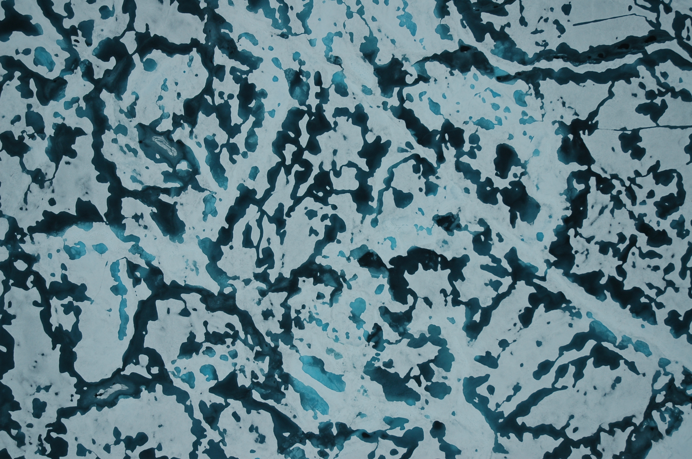

# ComplexSystemSimulation

#### Introduction
This repository contains code for the UVA Master course *Complex Systems Simulation*. The aim of the project is to model melt ponds on the arctic sea ice. During summer the arctic ice starts to melt forming ponds of clear water depending on the topography of the ice. Meltponds increase the melt-rate, since water has a lower albedo ( 5-22% level of reflection) than ice (80-95%). This is called the 'albedo feedback mechanism'. Eventually the individual meltponds will merge forming complex and percolating clusters.

#### How to run

Just run `server.py` file. It will open mesa board in your browser. You will see charts there of the simulation.
The server has some sliders, that can be used to change the initial model parameters. Its effects can only be seen after the model has
been restarted (the reset button on top of the browser has been pressed).

Regarding the Sensitivity Analysis, run the `sensitivity_analysis.py` file. This will produce the results and plots 
of the sensitivity analysis techniques used. 

In order to see the results of the conducted experiments, run the `run_experiments.py` file. You will see plots 
with the results of the experiments.

#### Structure

- `papers/...`: Inside this folder, you can find the main research papers that we used for inspiration when building this project.
- `UnitTests`: 
